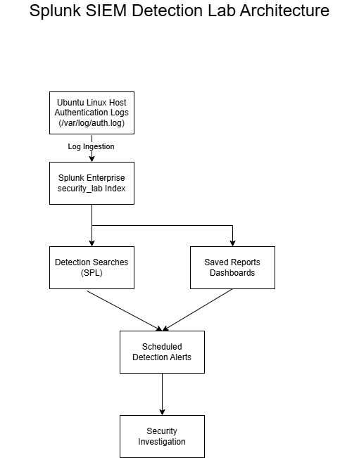

# Splunk SIEM Detection Lab

## Overview

Organizations depend on Security Information and Event Management (SIEM) platforms to collect security telemetry, detect suspicious activity, investigate incidents, and support compliance obligations. While many engineers understand how to deploy a SIEM, security architects must understand how to design, evaluate, and integrate a monitoring solution that aligns with business objectives, operational requirements, and risk tolerance.

This project documents the design and implementation of a local Splunk Enterprise SIEM laboratory. The objective is not simply to install Splunk, but to demonstrate the architectural thought process behind building an enterprise security monitoring capability.

## Architecture

## Architecture Lens

Throughout this project every major design decision is evaluated using the following criteria:

- Business Value
- Security
- Cost
- Operational Complexity
- Scalability
- Maintainability
- Vendor Lock-In
- Risk

---

## Business Problem

Modern organizations generate millions of security events across cloud platforms, servers, endpoints, applications, and identity systems.

Without centralized visibility:

- Security events become difficult to correlate.
- Threats remain undetected.
- Incident investigations take longer.
- Compliance reporting becomes more difficult.
- Operational risk increases.

Organizations require a centralized platform capable of collecting, normalizing, searching, and analyzing security telemetry while supporting rapid investigation and informed decision making.

---

## Project Objectives

This lab demonstrates how a Security Architect evaluates, designs, and implements a SIEM solution.

Objectives include:

- Deploy Splunk Enterprise locally
- Ingest Windows and Linux security logs
- Build dashboards
- Develop SPL searches
- Create custom detections
- Investigate simulated security incidents
- Document architecture decisions and tradeoffs
- Demonstrate enterprise security monitoring concepts

---

## Design Principles

- Security aligned to business objectives
- Cloud and platform agnostic architectural thinking
- Least privilege
- Defense in depth
- Operational simplicity
- Cost awareness
- Repeatable deployments
- Documented architectural decisions

---

## Technologies

- Splunk Enterprise
- Ubuntu Linux
- Windows
- Sysmon
- Docker (where appropriate)
- Git
- GitHub

---

## Repository Structure

(To be completed as the project evolves.)

---

## Current Status

Phase 0 — Project Initialization
