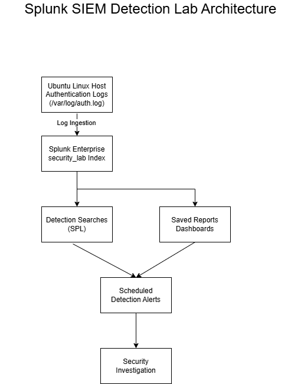

# Splunk SIEM Detection Lab

## Overview

This project is a hands-on Splunk Enterprise SIEM lab focused on security monitoring architecture, telemetry ingestion, SPL analysis, detection engineering, alerting, correlation, and investigation.

The lab was developed incrementally, beginning with requirements, constraints, architecture principles, environment assessment, and design tradeoffs before progressing into hands-on Splunk implementation.

The current implementation focuses primarily on Linux authentication telemetry and demonstrates how security events move from the operating system through centralized collection, investigation, detection logic, and correlation.

The objective is not to represent a production Splunk deployment. The project demonstrates how security monitoring requirements can be translated into architecture decisions and validated through hands-on implementation.

---

## Security Monitoring Lifecycle

The lab demonstrates the following security monitoring path:

```text
Linux System
     |
     v
Authentication Event
     |
     v
/var/log/auth.log
     |
     v
Splunk Ingestion
     |
     v
security_lab Index
     |
     v
SPL Search
     |
     v
Authentication Investigation
     |
     v
Detection Logic
     |
     v
Alerting / Correlation
     |
     v
Investigation Context
```

This connects architecture decisions with the actual telemetry and detection lifecycle.

---

## Business Problem

Organizations generate security telemetry across identity systems, endpoints, servers, applications, networks, and cloud platforms.

Without centralized visibility, security teams may have difficulty correlating activity across systems, identifying suspicious behavior, investigating incidents, retaining useful evidence, and supporting security and compliance reporting.

A SIEM provides centralized capabilities for collecting, searching, correlating, and analyzing security telemetry.

The architectural challenge is determining:

- Which telemetry provides meaningful security value
- How security events should be collected and retained
- Which behaviors should generate detections
- How detection logic should be validated
- How alerts support investigation and response
- How monitoring can scale without unnecessary operational complexity or cost

---

## Architecture



The architecture documentation establishes the requirements and design decisions behind the implementation.

Architecture artifacts include:

```text
architecture/
├── constraints.md
├── environment-assessment.md
├── principles.md
├── requirements.md
├── tradeoffs.md
├── decisions/
│   └── ADR-001-SIEM-Platform.md
└── splunk-siem-detection-lab-architecture.png
```

The architecture was developed before and alongside implementation so that technical choices could be evaluated against requirements, constraints, cost, operational complexity, maintainability, and risk.

---

## Architecture Lens

Major design decisions are evaluated across:

- Business value
- Security
- Cost
- Operational complexity
- Performance
- Scalability
- Maintainability
- Reliability and resilience
- Vendor dependency
- Risk

The objective is to evaluate not only whether a solution works technically, but whether it represents an appropriate architecture decision.

---

## Lab Environment

The environment uses Splunk Enterprise running locally with Ubuntu under WSL2.

The local architecture was selected to provide hands-on access to Splunk while avoiding unnecessary cloud infrastructure costs for a controlled learning environment.

The current implementation includes:

- Splunk Enterprise
- Ubuntu Linux
- Dedicated `security_lab` index
- Linux authentication telemetry
- `/var/log/auth.log`
- `linux_secure` sourcetype
- SPL-based investigation and detection logic

The environment contains simulated security activity rather than production data.

---

## Linux Authentication Monitoring

Linux authentication events provide the primary telemetry source for the current implementation.

Authentication data is collected from:

```text
/var/log/auth.log
```

and analyzed within:

```text
index=security_lab
sourcetype=linux_secure
```

Example search:

```spl
index=security_lab sourcetype=linux_secure
```

The telemetry supports investigation of activity including:

- Failed authentication
- Successful authentication
- Invalid users
- Root activity
- Sudo activity
- Authentication volume over time

Raw events are reviewed before detection logic is developed so searches are based on the actual structure and content of the ingested telemetry.

---

## Authentication Investigation

The lab includes hands-on authentication investigation using SPL.

Example failed-authentication search:

```spl
index=security_lab sourcetype=linux_secure "Failed password"
```

Controlled SSH authentication failures were generated to provide known security events for investigation.

The resulting events demonstrated the path from activity on the Linux system through operating-system logging, Splunk ingestion, search, and investigation.

This provides a known event against which detection logic can be developed and validated.

---

## Detection Engineering

The lab progresses from investigative searches into initial detection engineering.

The first detection scenario focuses on repeated failed SSH authentication.

Detection development considers:

- Business objective
- Threat scenario
- Required telemetry
- SPL logic
- Severity
- Thresholds
- False positives
- Tuning
- MITRE ATT&CK mapping
- Investigation workflow

The initial laboratory search is intentionally simple:

```spl
index=security_lab sourcetype=linux_secure "Failed password"
```

The current lab treats failed authentication as an informational signal while documenting how a production implementation could introduce time-based thresholds and additional context.

For example, a production design could evaluate multiple authentication failures from the same source within a defined period rather than alerting on every individual failure.

---

## MITRE ATT&CK Alignment

The failed-authentication detection scenario is associated with credential-based attack behavior such as brute force and password guessing.

The primary ATT&CK technique documented for the detection is:

```text
T1110 – Brute Force
```

ATT&CK mapping provides a consistent way to describe the attacker behavior a detection is intended to identify and can support broader detection-coverage analysis.

---

## Alerting

The project also examines the transition from manual investigation to automated monitoring.

A manual SPL search answers a question at a particular point in time.

An alert operationalizes search logic by adding:

```text
Search Logic
     +
Schedule
     +
Trigger Condition
     +
Alert Action
```

This distinction is important because detection engineering is not simply the creation of search queries. Operational detections also require appropriate scheduling, thresholds, actions, ownership, tuning, and ongoing review.

---

## Authentication Correlation

The lab extends individual-event analysis by correlating related authentication activity.

Implemented correlation:

```spl
index=security_lab sourcetype=linux_secure earliest=-15m
("Failed password" OR "Accepted password")
| transaction host maxspan=5m
| search eventcount>1
| table _time host eventcount duration _raw
```

This groups related authentication events occurring on the same host within a five-minute period.

The resulting investigation view provides:

- Host
- Event count
- Transaction duration
- Original authentication events
- Context around related login activity

Correlation provides more investigative value than examining isolated authentication failures independently.

---

## Correlation Tradeoff

The Splunk `transaction` command provides an intuitive way to group related events and is useful for investigation and controlled demonstrations.

However, it can consume more resources than statistical aggregation approaches.

For larger production environments, alternatives such as:

```text
stats
streamstats
accelerated data models
```

may provide more scalable correlation patterns.

The lab intentionally documents this distinction between a technique that works well for learning and investigation and an approach that may be preferable at enterprise scale.

---

## Design Principles

The project follows several architecture principles:

### Security Outcomes Before Tooling

Monitoring requirements should determine telemetry and detection strategy rather than allowing available tooling to define the security objective.

### Detection Requires Useful Telemetry

Detection quality depends on the quality, completeness, and context of the underlying security telemetry.

### Investigation Requires Context

Alerts should provide enough information for an analyst to determine what happened and whether additional investigation is required.

### Operational Complexity Matters

A technically capable security platform still requires sustainable administration, tuning, ownership, and maintenance.

### Cost Is an Architecture Constraint

Telemetry volume, retention, search behavior, and platform architecture all influence SIEM cost.

### Detection Logic Must Be Tested

A query should not be considered an effective detection simply because it executes successfully. Detection logic should be validated against known or simulated activity.

---

## Current Status

The lab has progressed from architecture and planning into hands-on Splunk implementation and initial detection engineering.

Implemented capabilities include:

- Architecture requirements and constraints
- Environment assessment
- Architecture Decision Record
- Splunk Enterprise environment
- Dedicated `security_lab` index
- Linux authentication log ingestion
- `linux_secure` sourcetype
- SPL searching and analysis
- Authentication investigation
- Controlled SSH authentication failure testing
- Initial failed-authentication detection
- Detection metadata and MITRE ATT&CK mapping
- Alert lifecycle analysis
- Authentication event correlation
- Investigation of related authentication activity

The current implementation primarily focuses on Linux authentication telemetry.

Windows/Sysmon monitoring, broader dashboards, additional detection scenarios, expanded telemetry sources, and more scalable correlation techniques remain areas for future development.

---

## Architecture Guide

The repository contains a detailed architecture guide covering the concepts explored during the project.

Topics include:

- Splunk architecture
- Data ingestion
- Indexes and buckets
- SPL
- Forwarders
- Knowledge objects
- Apps and add-ons
- Dashboards, reports, and alerts
- Security architecture
- Detection engineering
- Incident investigation
- Configuration decisions
- SIEM business value
- Security operations lifecycle
- Events and fields
- SPL fundamentals
- Authentication investigation
- Detection engineering fundamentals
- Splunk alerting
- Authentication correlation

These documents provide architecture context around the hands-on implementation rather than serving as evidence that every described enterprise capability has been deployed.

---

## Technologies

- Splunk Enterprise
- Ubuntu Linux
- WSL2
- Linux authentication logging
- SPL
- SSH
- Git
- GitHub

Windows, Sysmon, and additional telemetry sources remain part of the planned expansion of the lab.

---

## Repository Structure

```text
splunk-siem-detection-lab/
├── README.md
├── CHANGELOG.md
├── architecture/
│   ├── constraints.md
│   ├── environment-assessment.md
│   ├── principles.md
│   ├── requirements.md
│   ├── tradeoffs.md
│   ├── decisions/
│   │   └── ADR-001-SIEM-Platform.md
│   └── splunk-siem-detection-lab-architecture.png
└── docs/
    ├── architecture-guide/
    └── roadmap.md
```

---

## Scope

This repository represents a controlled hands-on security monitoring environment.

It is not intended to represent:

- A production Splunk deployment
- A complete SOC implementation
- An enterprise-scale SIEM architecture
- A production-ready detection library
- A certified compliance monitoring solution

The lab demonstrates practical SIEM architecture and detection concepts while clearly separating implemented capabilities from future enterprise-scale considerations.

---

## Key Takeaway

A SIEM provides value when telemetry can be transformed into actionable security context.

This lab demonstrates that progression:

```text
Security Activity
       ↓
Telemetry
       ↓
Collection
       ↓
Search
       ↓
Investigation
       ↓
Detection
       ↓
Alerting
       ↓
Correlation
       ↓
Security Decision
```

The project connects architecture decisions with hands-on implementation and demonstrates how security monitoring evolves from centralized logging into detection and investigation capability.
